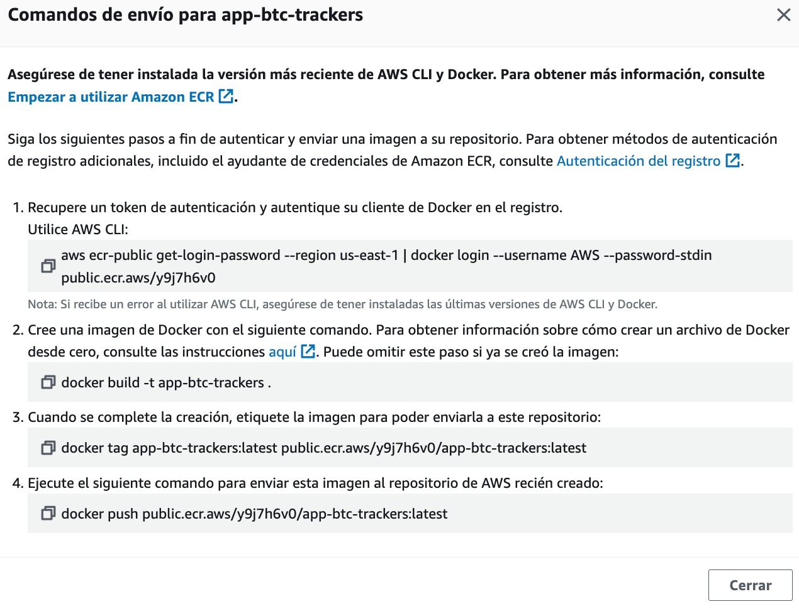

# Guía de Despliegue de la Aplicación con Docker
Esta guía proporciona los pasos necesarios para desplegar una aplicación web desarrollada en React utilizando Docker. El enfoque utilizado aquí utiliza un archivo Dockerfile y un archivo de configuración de Nginx para empaquetar la aplicación en un contenedor de Docker y exponerla a través de un servidor web.

## Requisitos
Asegúrate de tener instalado lo siguiente en tu sistema antes de comenzar:

## Docker: Instrucciones de instalación de Docker

Sigue estos pasos para desplegar tu aplicación web con Docker:

1. Configurar el archivo Dockerfile
Abre el archivo Dockerfile y asegúrate de que tiene el siguiente contenido:

dockerfile
Copy code
FROM node:16-alpine as builder

2. Establece el directorio de trabajo dentro del contenedor

```bash
WORKDIR /app

# Copia los archivos de la aplicación
COPY . .

# Instala las dependencias (npm ci se asegura de instalar las versiones exactas del archivo lockfile)
RUN npm ci

# Construye la aplicación
RUN npm run build

# Empaqueta los recursos estáticos con Nginx
FROM nginx:1.21.0-alpine as production

# Establece las variables de entorno
ENV NODE_ENV production
ENV REACT_APP_API_URL https://3kpetbu865.execute-api.us-east-1.amazonaws.com

# Copia los recursos construidos desde la imagen 'builder'
COPY --from=builder /app/build /usr/share/nginx/html

# Agrega tu archivo nginx.conf
COPY nginx.conf /etc/nginx/conf.d/default.conf

# Expone el puerto
EXPOSE 80

# Inicia Nginx
CMD ["nginx", "-g", "daemon off;"]

```

2. Asegúrate de que el contenido del archivo coincida exactamente con el proporcionado.

3. Configurar el archivo nginx.conf
Abre el archivo nginx.conf y configúralo según tus necesidades. Este archivo se utilizará para la configuración de Nginx dentro del contenedor. Asegúrate de que esté correctamente configurado para servir la aplicación React.

4. Construir la imagen de Docker
Abre una terminal y navega hasta el directorio raíz de tu proyecto. Asegúrate de que el archivo Dockerfile y el archivo nginx.conf se encuentren en el mismo directorio.

Ejecuta el siguiente comando para construir la imagen de Docker y Reemplaza nombre_imagen con el nombre que deseas darle a tu imagen de Docker.:

```bash
$ docker build -t nombre_imagen .
```

5. Ejecutar el contenedor de Docker
Una vez que la imagen de Docker se haya construido correctamente, puedes ejecutar un contenedor basado en esa imagen.

Ejecuta el siguiente comando para iniciar el contenedor:

```bash
$ docker run -p 5000:80 nombre_imagen
```


6. Acceder a la aplicación
Una vez que el contenedor esté en ejecución, puedes acceder a tu aplicación web en tu navegador web ingresando la siguiente dirección:

localhost:5000 o con el puerto que hayas elegido


# Creación y Configuración de Elastic Container Registry (ECR)

## Requisitos Previos
Antes de comenzar, asegúrate de tener lo siguiente:

1. La AWS Command Line Interface (CLI) instalada en tu máquina local y configurada con las credenciales de tu cuenta de AWS.

Sigue los siguientes pasos para crear y configurar Elastic Container Registry (ECR) en AWS:

1. Inicia sesión en la Consola de Administración de AWS con tus credenciales de cuenta de AWS.

2. Navega a ECR: En la consola de administración de AWS, busca y selecciona "Elastic Container Registry" en la barra de búsqueda o navega a través de los servicios hasta encontrarlo.

3. Crea un Repositorio: Haz clic en "Crear Repositorio" para crear un nuevo repositorio de imágenes de contenedores.

- Asigna un nombre descriptivo al repositorio.
- Puedes agregar una etiqueta si deseas categorizar el repositorio.
- Configura las opciones de privacidad y políticas de acceso según tus necesidades.
Haz clic en "Crear Repositorio" para finalizar la creación.


Una vez creado el repositorio nos dan una serie de pasos a seguir 



dandonos como resultado algo similar a esto


# Creación y Configuración de Elastic Container Service (ECS)

Acontinuacion vamos a tener que crear y configurar el cluster y la definicion de tarea y los contendores en Amazon ECS

## 1. Crea un Cluster de ECS
En la Consola de Administración de AWS, navega a Amazon ECS y crea un nuevo cluster de ECS. Puedes elegir entre un cluster de tipo Fargate o un cluster gestionado por EC2 según tus necesidades, pero en mi caso use fargate


## 2. Crea una Definición de Tarea
Dentro del cluster de ECS, crea una nueva definición de tarea que describa cómo se ejecutará tu aplicación en los contenedores.

- Define los recursos necesarios para la tarea, como la cantidad de CPU y memoria.
- Agrega definiciones de contenedor para cada uno de los contenedores que deseas ejecutar en la tarea.
- Configura las opciones de red y almacenamiento según tus necesidades.


## 3. Configura los Contenedores
Dentro de la definición de tarea, configura los contenedores que se ejecutarán en la tarea. Para cada contenedor:

- Asigna un nombre descriptivo.
- Especifica la imagen del contenedor desde el repositorio de imágenes(ECR) el cual habiamos creado anteriormente


copiamos la url y la pegamos


Asegurate de mapear los puertos y que el grupo de seguridad del VPC tenga el puerto 80 abierto

## 3. Crear servicio

por ultimo creamos el servicio al cual selecionaremos servicio como tipo de aplicacion y en la familia la anterior tarea que habiamos creado


ingresamos al servicio creado y navegamos hasta redes donde nos mostrara nuestra url de acceso: 


